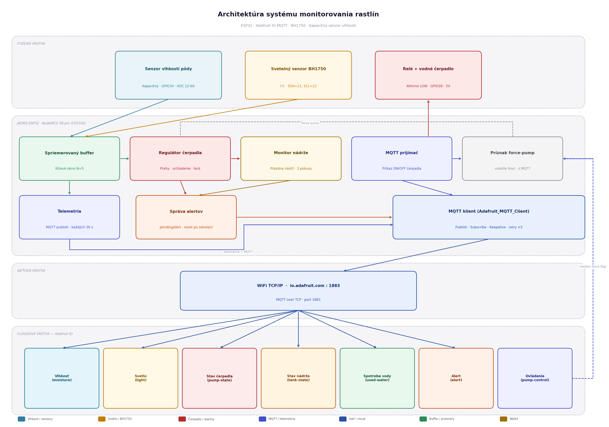
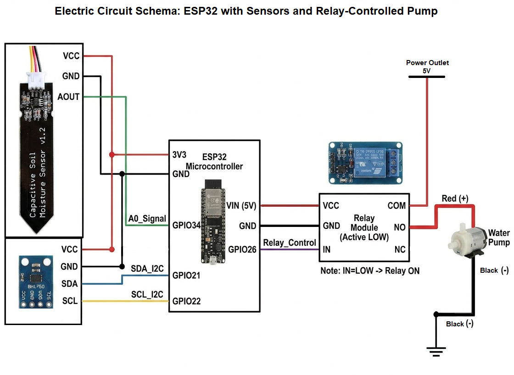
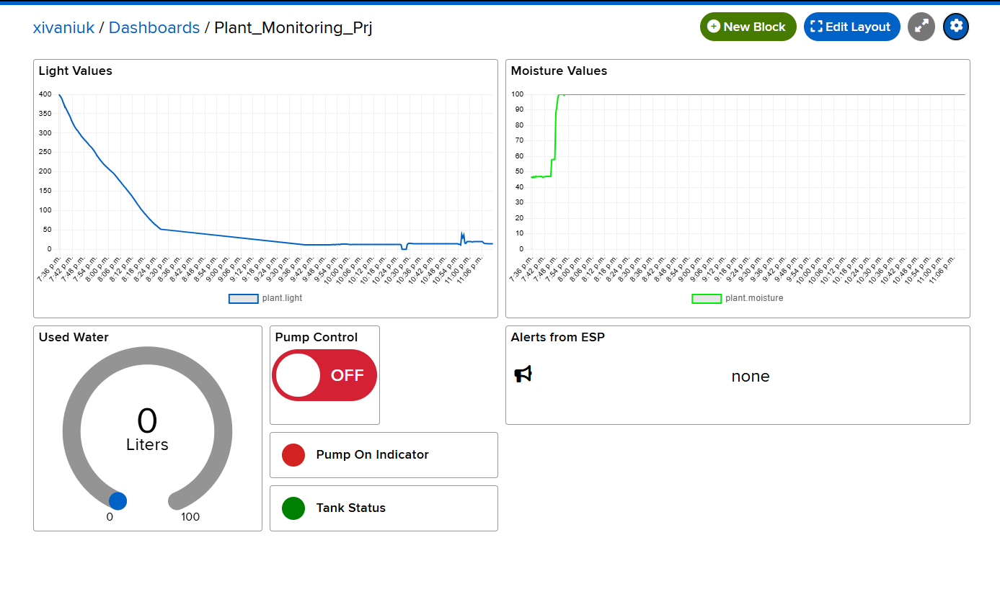

# 🌿 Plant Monitor — ESP32 Smart Watering & Sensor System

> Automated plant watering system with soil moisture sensing, ambient light monitoring, and real-time cloud dashboard — built on ESP32 with Adafruit IO.


<!-- 💡 TIP: Add a nice hero photo here — the whole setup on a desk, plant included -->

<!-- [](LICENSE) -->
[](https://www.espressif.com/)
[](https://io.adafruit.com/)
[](https://arduino.cc/)

---

## 📋 Table of Contents

- [About the Project](#-about-the-project)
- [System Architecture](#-system-architecture)
- [Hardware Components](#-hardware-components)
- [Wiring Diagram](#-wiring-diagram)
- [Dashboard Preview](#-dashboard-preview)
- [Design Decisions](#-design-decisions)
- [Project Structure](#-project-structure)
- [Getting Started](#-getting-started)
  - [Prerequisites](#prerequisites)
  - [Flashing the Firmware](#flashing-the-firmware)
  - [Setting Up the Dashboard](#setting-up-the-adafruit-io-dashboard)
- [Data Format](#-data-format)
- [Pump Logic & Safety](#-pump-logic--safety)
- [Live Dashboard](#-live-dashboard)

---

## 🌱 About the Project

This system automatically monitors your plant's soil moisture and ambient light, and waters it when the soil gets too dry — almost without any manual intervention.

**Key features:**
- 📡 Real-time telemetry published to Adafruit IO every 30 seconds via MQTT
- 💧 Automatic pump control based on configurable moisture thresholds
- 🔒 Safety mechanisms: pump lock-out, tank-empty detection, max runtime cutoff, hardware watchdog
- 🕹️ Manual pump override directly from the cloud dashboard
- 📊 Historical charts for moisture and light intensity
- ⚠️ Alert feed for fault conditions (empty tank, pump lock, sensor fault)

This project was created as a semester assignment for the I-MISA course at STU BA.

---

## 🏗 System Architecture



<!-- 💡 TIP: Replace this placeholder with your actual architecture diagram image -->

---

## 🔧 Hardware Components

| # | Component | Category | Link |
|---|-----------|----------|------|
| 1 | ESP32 NodeMCU (38-pin, CP2102) | MCU | [techfun.sk](https://techfun.sk/produkt/esp32-nodemcu-38-pin-verzia-s-cp2102/) |
| 2 | Capacitive Soil Moisture Sensor | **B** — Analog | [techfun.sk](https://techfun.sk/produkt/kapacitny-senzor-vlhkosti-pody/) |
| 3 | BH1750 Light Intensity Sensor | **A** — I²C | [techfun.sk](https://techfun.sk/produkt/senzor-intenzity-svetla-bh-1750/) |
| 4 | Mini Water Pump (horizontal) | Actuator | [techfun.sk](https://techfun.sk/produkt/mala-vodna-pumpa/) |
| 5 | 1-Channel 5V Relay Module (optocoupler) | Actuator driver | [techfun.sk](https://techfun.sk/produkt/rele-modul-1-kanal-5v-so-zabudovanym-optoclenom/) |
| 6 | Water Pump Tube 6.5mm | Misc | [techfun.sk](https://techfun.sk/produkt/hadicka-pre-vodne-pumpy-6-5mm/) |
| 7 | 830-point Breadboard | Prototyping | [techfun.sk](https://techfun.sk/produkt/nepajive-pole-830-bodov/) |

> **Sensor categories:** A = digital bus (I²C/SPI/UART/1-Wire), B = analog (ADC required)

---

## 🔌 Wiring Diagram


<!-- 💡 TIP: Add your wiring schematic here — Fritzing, KiCad export, or even a clean hand-drawn photo works great -->

| ESP32 Pin | Connected To |
|-----------|-------------|
| `GPIO34` (ADC input-only) | Soil moisture sensor — signal |
| `GPIO21` (SDA) | BH1750 — SDA |
| `GPIO22` (SCL) | BH1750 — SCL |
| `GPIO26` (output) | Relay module — IN (active LOW) |
| `3.3V` | Moisture sensor VCC, BH1750 VCC |
| `5V` | Relay VCC |
| `GND` | All sensor grounds |

> ⚠️ The relay module is **active LOW** — `HIGH` on GPIO26 = pump OFF. This is intentional so the pump stays off on any reset/boot.

---

## 📊 Dashboard Preview


<!-- 💡 TIP: Take a screenshot of your live Adafruit IO dashboard and place it at docs/dashboard.png -->

The dashboard at **[https://io.adafruit.com/xivaniuk/dashboards/plant-monitoring-prj?kiosk=true920.](https://io.adafruit.com/xivaniuk/dashboards/plant-monitoring-prj?kiosk=true)** includes:

- 📈 Soil moisture chart (last 24 hours)
- ☀️ Light intensity chart (last 24 hours)
- 🟢/🔴 Pump state indicator
- 🟢/🔴 Tank state indicator
- 💧 Total water used gauge (litres)
- ⚠️ Active alert text feed
- 🕹️ Manual pump ON/OFF toggle

---

## 💡 Design Decisions

### Why ESP32?
The ESP32 has built-in WiFi, a 12-bit ADC for the analog moisture sensor, hardware I²C for BH1750, and enough GPIO for the relay — all in one cheap package. The Arduino framework gives access to mature libraries for MQTT and BH1750 without reinventing the wheel.

### Why MQTT over HTTP?
MQTT's publish/subscribe model is a natural fit for IoT telemetry. It's lightweight, keeps persistent connections, and supports bidirectional communication — the pump control toggle subscribes back from Adafruit IO without polling.

### Why Adafruit IO?
Zero infrastructure to manage. Adafruit IO provides a free MQTT broker, persistent feed storage, dashboard builder, and public access URL out of the box. For a student project this avoids running a VPS, configuring and building a frontend from scratch.

### Why a capacitive moisture sensor (Category B / analog)?
Capacitive sensors resist corrosion compared to resistive probes and give a stable analog signal over time. The ADC reading is mapped to a 0–100% range with calibrated dry/wet endpoints (`MOISTURE_DRY_RAW = 3200`, `MOISTURE_WET_RAW = 1200`). A 5-sample rolling average further suppresses ADC noise.

### Measurement period
Sensors are sampled every **1 second** (rolling average window of 5 samples) but telemetry is published to the cloud every **30 seconds** to stay within Adafruit IO's free-tier rate limit of ~30 data points/minute across all feeds.

---

## 📁 Project Structure

```
/
├── firmware/
│   └── src/
│       └── main.cpp          # ESP32 Arduino firmware
├── visualisation/
│   └── setup_dashboard.py    # Adafruit IO dashboard provisioning script
├── docs/
│   ├── schema.png            # Wiring schematic
│   ├── architecture.png      # System architecture diagram
│   └── dashboard.png         # Dashboard screenshot
└── README.md
```

---

## 🚀 Getting Started

### Prerequisites

**Hardware:**
- All components listed in [Hardware Components](#-hardware-components)
- USB cable (micro-USB for the ESP32 NodeMCU)
- 5V power supply or USB power bank
- A plant 🌱

**Software:**
- [PlatformIO](https://platformio.org/) (VS Code extension recommended) or Arduino IDE 2.x
- Python 3.8+ (for the dashboard setup script)
- `pip install requests`

---

### Flashing the Firmware

1. **Clone the repository**

   ```bash
   git clone https://github.com/NegroAmigo/Plant_Monitoring_System.git
   cd Plant_Monitoring_System
   ```

2. **Set your credentials**

   The firmware reads secrets from PlatformIO build flags. Create or edit `private_env.ini`:

   ```ini
    [env:esp32dev]
    build_flags = 
        -DWIFI_SSID="WIFI_NAME"
        -DWIFI_PASSWORD="WIFI_PASS"
        -DAIO_KEY="API_KEY"
        -DAIO_USERNAME="ADAFRUIT_SERNAME"
   ```

   > 🔑 Get your Adafruit IO key at [io.adafruit.com -> My Key](https://io.adafruit.com/YOUR_USERNAME/key)

3. **Build and upload**

   ```bash
   pio run --target upload
   ```

   Or use the PlatformIO VS Code sidebar: **Project Tasks -> Upload**.

4. **Open Serial Monitor** (115200 baud) to see the boot log and live sensor readings.

   On boot the firmware will:
   - Initialize GPIO and relay (pump OFF)
   - Start I²C and probe BH1750
   - Connect to WiFi
   - Connect to Adafruit IO MQTT
   - Prime the 5-sample sensor buffer
   - Run a self-test (relay click, sensor check)

---

### Setting Up the Adafruit IO Dashboard

The `visualisation/setup_dashboard.py` script automatically creates all feeds and dashboard blocks via the Adafruit IO REST API.

1. **Run the script**

   ```bash
   cd visualisation
   AIO_USERNAME=your_username AIO_KEY=your_key python setup_dashboard.py
   ```

2. The script will:
   - Find or create the `Plant_Monitoring_Prj` dashboard
   - Create all 7 blocks (moisture chart, light chart, pump indicator, tank indicator, water gauge, alert text, pump toggle)

3. Open the dashboard URL printed at the end.

> ℹ️ If you re-run the script on an existing dashboard, it will reuse it and only add missing blocks.

---

## 📦 Data Format

Data is published as plain numeric strings (or short keyword strings) per Adafruit IO convention — one value per feed. There is no JSON envelope at the MQTT level; the feed key encodes the meaning.

| Feed | Type | Example value | Description |
|------|------|---------------|-------------|
| `plant-dot-moisture` | float | `58.3` | Soil moisture 0–100% |
| `plant-dot-light` | float | `420.0` | Ambient light in lux |
| `plant-dot-pump-state` | string | `1.0` / `0.0` | Pump running (1) or off (0) |
| `plant-dot-tank-state` | string | `1.0` / `0.0` | Tank empty (1) or ok (0) |
| `plant-dot-used-water` | float | `0.042` | Cumulative water used in litres |
| `plant-dot-alert` | string | `TANK_EMPTY` | Alert code or `none` |
| `plant-dot-pump-control` | string | `ON` / `OFF` | Control command (bidirectional) |

All feeds are grouped under the `plant-monitoring-feed` Adafruit IO group.

---

## 💧 Pump Logic & Safety

The pump controller (`handlePump()`) implements a layered safety model:

```
Moisture < 35% AND cooldown elapsed AND no fault -> PUMP ON
Moisture ≥ 70%                                  -> PUMP OFF (target reached)
Running time ≥ 15 s                             -> PUMP OFF (max runtime exceeded)
tankEmpty == true                               -> PUMP BLOCKED
pumpLocked == true                              -> PUMP BLOCKED
moistureFault == true                           -> AUTO-START BLOCKED
```

**Tank empty detection:** After each fault-stop, if the moisture reading didn't rise by at least 3% the system counts a "strike". After 3 strikes, `tankEmpty` is set and the pump is disabled until the state is cleared.

**Pump lock:** After 3 general failures (not necessarily tank-related), the pump is locked out entirely.

**Cooldowns:**
- Normal cooldown between runs: `100 s`
- Cooldown after a failed run: `300 s`

**Manual override:** An `ON` command via MQTT bypasses the moisture lower threshold but still respects the tank/locked/fault and high moisture guards.

---

## 🌐 Live Dashboard

The dashboard is publicly accessible at:

**➡️ [https://io.adafruit.com/xivaniuk/dashboards/plant-monitoring-prj?kiosk=true](https://io.adafruit.com/xivaniuk/dashboards/plant-monitoring-prj?kiosk=true)**

No login required to view.


*Made with ☕ and overwatering anxiety — Ivaniuk Andrii*